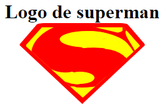

# Drawing with HTML and CSS

In this repository, there are some practices about learning CSS, so, if you want to use it in your project, you can do it, and off course, I hope your feedback to improve.

# HTML5
Final result of the HTML5's logo.

# Superman's logo
Final result of the superman's logo.

# License
This is open-sourced software licensed under the [MIT license](https://opensource.org/licenses/MIT).